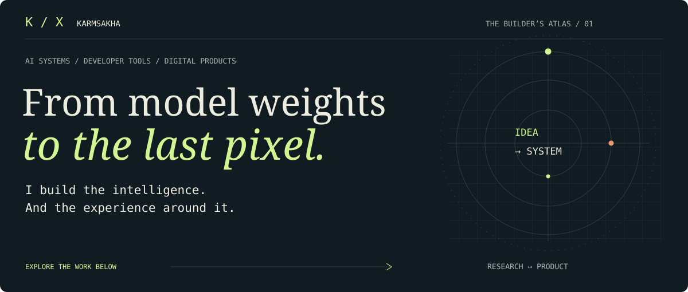
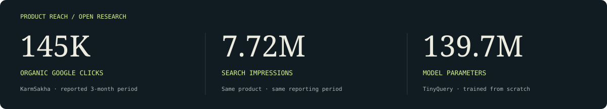
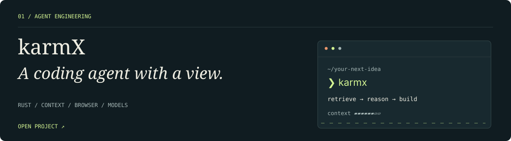
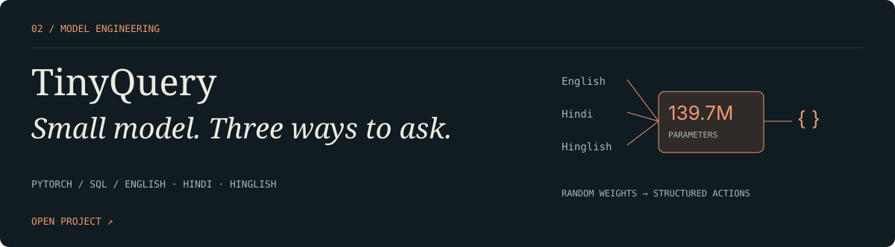
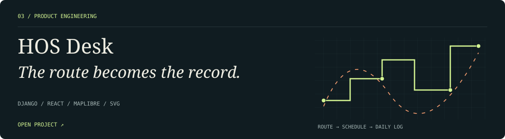
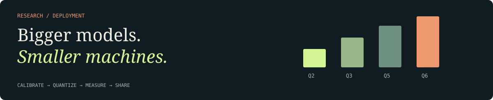
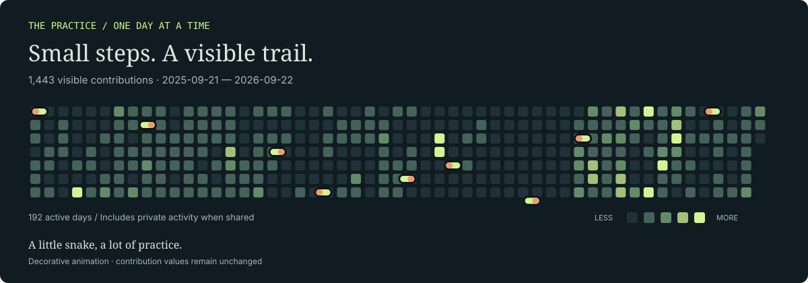
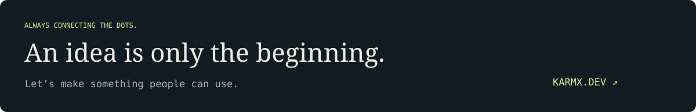

<p align="center">
  <a href="https://karmx.dev"></a>
</p>

<p align="center">
  <a href="#user-content-selected-work">Selected work</a> &nbsp; / &nbsp;
  <a href="https://karmsakha.github.io/KarmSakha/">Play arcade ↗</a> &nbsp; / &nbsp;
  <a href="#user-content-experience">Experience</a> &nbsp; / &nbsp;
  <a href="#user-content-beyond-the-public-repos">Private projects</a> &nbsp; / &nbsp;
  <a href="#user-content-a-visible-trail">Activity</a> &nbsp; / &nbsp;
  <a href="#user-content-the-complete-public-index">All repositories</a>
</p>

<br />

## Yaman Khetan

**Full-stack AI engineer & founder** · Surat, India

I build **software people can use** — from AI models and agents to production web platforms and native apps.

My work connects the model and backend to the interface, payments, deployment, and everyday operation.

**6+ years building software and automation.** **3+ years shipping production web, data, and AI systems.**

Running a family manufacturing business since 2015 taught me to build around real constraints: people, time, reliability, and getting the work out the door.

<p align="center">
  <a href="https://karmx.dev">Portfolio ↗</a> &nbsp; · &nbsp;
  <a href="https://karmsakha.com">KarmSakha ↗</a> &nbsp; · &nbsp;
  <a href="https://www.linkedin.com/in/yaman-khetan-430a7b1a5/">LinkedIn ↗</a> &nbsp; · &nbsp;
  <a href="https://huggingface.co/karmx">Models & datasets ↗</a>
</p>



<sub>Product reach is from a three-month period reported in my résumé, not a live analytics feed. Model details and evaluations are published in the linked repositories.</sub>

<br />

## Selected work

<a href="https://github.com/KarmSakha/karmx-agent"></a>

**[Explore karmX →](https://github.com/KarmSakha/karmx-agent)** · [Website](https://karmx.dev)

Built on a fork of **[Block’s goose](https://github.com/block/goose)** (Apache-2.0), with my work focused on prompt enhancement, context retrieval, browser integration, model pairing, and predictive compaction. [Provenance](https://github.com/KarmSakha/karmx-agent/blob/main/NOTICE).

<details>
<summary><strong>Inside the agent → context, browser, collaboration</strong></summary>

- **Prompt enhancement:** turn an initial idea into an editable, more specific instruction.
- **Context engine:** retrieve and rank useful code within a context budget.
- **Live browser preview:** inspect rendered DOM and console output.
- **Local fusion:** a lead model and sidekick working in one session.
- **Predictive compaction:** prepare summaries before the context window fills.
- **Provider flexibility:** connect an OpenAI-compatible endpoint.

The project README covers installation, configuration, and the implementation’s capabilities.

</details>

<br />

<a href="https://github.com/KarmSakha/TinyQuery-140M"></a>

**[Explore TinyQuery →](https://github.com/KarmSakha/TinyQuery-140M)** · [Model weights](https://huggingface.co/karmx/TinyQuery-140M) · [Dataset](https://huggingface.co/datasets/karmx/TinyQuery-Tools-Multilingual)

<details>
<summary><strong>Inside the experiment → architecture, data, evaluation</strong></summary>

A custom PyTorch decoder with **139,738,113 parameters**, grouped-query attention, and a source-copy head. Student weights start from random initialization. The published corpus contains **347,376 examples**.

| Published evaluation | Full task success |
| :--- | :--- |
| Held-out synthetic test | 92.47% · 1,106 / 1,196 |
| Additional manual phrasing | 82.50% · 132 / 160 |

These are checkpoint-specific project results, not production accuracy or evidence of general-purpose reasoning. The model generates structured actions; database execution belongs to the host application. [Read the evaluation and limitations.](https://github.com/KarmSakha/TinyQuery-140M/blob/main/MODEL_CARD.md)

</details>

<br />

<a href="https://github.com/KarmSakha/truck-log"></a>

**[Explore HOS Desk →](https://github.com/KarmSakha/truck-log)** · [Try the live planner](https://hosdesk.karmx.dev)

<details>
<summary><strong>Inside the product → routing, constraints, visual explanation</strong></summary>

A Django API and React/MapLibre interface that connects trip routing to duty schedules and daily paper-style logs. The planner models driving windows, breaks, rest, fuel stops, and cycle limits; the interface connects the route map with the log timeline.

A planning prototype with documented assumptions, **not a certified ELD**. [Explore the implementation and tests.](https://github.com/KarmSakha/truck-log)

</details>

<br />

## After hours · developer arcade

<a href="https://karmsakha.github.io/KarmSakha/"></a>

**[Play Pixel Snake →](https://karmsakha.github.io/KarmSakha/#snake)** · **[Take Debug Quest →](https://karmsakha.github.io/KarmSakha/#debug)** · **[Open Dev Terminal →](https://karmsakha.github.io/KarmSakha/#terminal)**

A little space for the joy of building. Keyboard and touch controls, a personal Snake high score, and five bugs between you and green. No account needed. Games open in the companion arcade; the profile itself stays easy to browse.

<details>
<summary><strong>A 10-second side quest: what does this JavaScript return?</strong></summary>

```js
[1, 2, 3].map(number => { number * 2; });
```

<details>
<summary>Reveal the answer</summary>

`[undefined, undefined, undefined]`. A block-bodied arrow function needs an explicit `return`. Write `number => number * 2` or `number => { return number * 2; }`.

More challenges await in **[Debug Quest](https://karmsakha.github.io/KarmSakha/#debug)**.

</details>
</details>

<br />

## The model lab



My community quantization releases explore **mixed precision, long-context inference, and consumer-GPU deployment**. The base models belong to their upstream authors; my work is the calibration, quantization, packaging, and evaluation documented in each release.

| Release | Focus | Evidence |
| :--- | :--- | :--- |
| [Qwen3.8 · 27B](https://github.com/KarmSakha/Qwen3.8-27B-OBLITERATED-Mixed-128K-GGUF) | Mixed GGUF with preserved MTP draft head | Tensor recipe, hardware measurements, reproduction commands |
| [Qwen3.6 · 35B-A3B](https://github.com/KarmSakha/Qwen3.6-35B-A3B-Uncensored-Mixed-128K-GGUF) | Two mixed-precision builds for 16 GB GPU experiments | Calibration pipeline, checksums, benchmark files |
| [Nex-N2.5-mini](https://github.com/KarmSakha/Nex-N2.5-mini-Mixed-Q2Q3-128K-GGUF) | Mixed Q2/Q3 with documented deployment tradeoffs | Reproduction guide, evaluation, and limitations |

<details>
<summary><strong>What “128K” means in this work</strong></summary>

A configured context capacity is not a guarantee of reliable retrieval or reasoning across that entire window. Results depend on hardware, runtime, cache precision, and workload. The Nex release records a failed no-regression gate and long-context accuracy limitations. Each repository preserves the relevant evidence instead of turning a capacity number into a general capability claim.

</details>

<br />

## Experience

**From running operations to building the software behind them.**

| Period | Role & focus |
| :--- | :--- |
| **Aug 2023–present** | **Product Engineer & Founder · KarmSakha** — career and exam-preparation platform, ingestion pipelines, job recommendations, payments, and production operations. |
| **Jan 2026–present** | **AI Systems & Product Engineer · KarmX** — local model serving, agent orchestration, evaluation pipelines, and open-source model releases. |
| **Jan 2026–present** | **Founder & Full-Stack Product Engineer · Udayy** — building a free K–12 learning platform, initially focused on CBSE, with teachers and content collaborators. |
| **Jan 2024–present** | **Founder & E-commerce Engineer · Zylver** — Shopify storefront engineering alongside payments, orders, logistics, and marketing. |
| **Apr 2015–present** | **Owner · Vaidehi Rigids** — family packaging-manufacturing operations; automating order, production, and dispatch workflows since 2019. |

<details>
<summary><strong>KarmSakha · what end-to-end ownership looks like</strong></summary>

- Built a career and exam-preparation product covering government-job discovery, mock tests, current affairs, courses, eBooks, accounts, and paid content.
- Designed ingestion across approximately **12,000 source domains**, with normalization, deduplication, and validation before publication.
- Built personalized recommendations and conversational job discovery through a WhatsApp AI bot.
- Connected application accounts and content access with checkout, payment webhooks, and entitlement fulfillment.
- Operate containerized releases with health checks and CI/CD; handle application, database, DNS, and SSL troubleshooting.

These describe my product and engineering responsibilities. Private implementation and operational details remain closed.

</details>

<details>
<summary><strong>KarmX · systems around the model</strong></summary>

My work includes authenticated model serving, streaming and tool calling, model routing, isolated parallel-agent execution, context budgets, and failover. I build resumable evaluations covering coding, multilingual instructions, OCR, vision, retrieval, speed, and memory.

I use Claude Code and Codex in the development loop, checking generated changes with tests, rendered interfaces, and executable validation.

</details>

<br />

## How I build

| Layer | Tools I work with | Where they show up |
| :--- | :--- | :--- |
| **Interface** | TypeScript, React, Next.js, Tailwind, Shopify Liquid | Product interfaces, content platforms, commerce storefronts |
| **Services & data** | Python, FastAPI, Node.js, SQL, PostgreSQL, Supabase, SQLite | APIs, authentication, webhooks, ingestion, data validation |
| **Models & agents** | PyTorch, llama.cpp, GGUF, LLM APIs, tool calling, LightGBM | Training, quantization, agent workflows, evaluations |
| **Delivery** | Docker, Linux, GitHub Actions, Playwright, monitoring | CI/CD, blue-green releases, integration and regression checks |

<details>
<summary><strong>Education & foundations</strong></summary>

- **Post Graduate Diploma in Data Science** · IIIT Bangalore · 2018–2019
- **Bachelor of Management Studies** · Wilson College, Mumbai · 2012–2015

</details>

<br />

## Beyond the public repos


These projects are part of my private portfolio. **🔒 Private** means the source stays closed; the descriptions below explain the work without exposing code, internal services, customer information, or credentials. Projects span products, prototypes, and adaptations of existing software.

<details>
<summary><strong>Interview Copilot</strong> · 🔒 Private</summary>

A native assistant combining on-device speech transcription with a live, streamed response interface.

**Tools:** Swift · macOS

</details>

<details>
<summary><strong>NityaTrader / algomac</strong> · 🔒 Private</summary>

A native trading workspace with live quotes, charts, order workflows, a command palette, and a trading journal. Built around OpenAlgo.

**Tools:** SwiftUI · macOS

</details>

<details>
<summary><strong>STRIKE</strong> · 🔒 Private</summary>

A mobile-first market and trading console connecting an interactive web interface with an analysis engine.

**Tools:** TypeScript · Python

</details>

<details>
<summary><strong>Find My Path</strong> · 🔒 Private</summary>

A jobs and exam-preparation platform spanning state job hubs, courses, eBooks, test series, and checkout.

**Tools:** Next.js · TypeScript

</details>

<details>
<summary><strong>GovJobsBuilder</strong> · 🔒 Private</summary>

A job-notification aggregation pipeline with document extraction, structured data processing, and an API.

**Tools:** Python

</details>

<details>
<summary><strong>Reworkin / sponsoruk</strong> · 🔒 Private</summary>

A sponsorship-research product with searchable sponsor pages, research tools, saved records, and subscriptions.

**Tools:** Next.js · TypeScript

</details>

<details>
<summary><strong>Udayy Kids</strong> · 🔒 Private</summary>

A multilingual stories and lullabies experience with audio playback, content publishing, and search-friendly pages.

**Tools:** Next.js · TypeScript

</details>

<details>
<summary><strong>WhatsApp Business Manager</strong> · 🔒 Private</summary>

A shared customer inbox with contact management, message templates, conversation workflows, and analytics.

**Tools:** React · TypeScript

</details>

<details>
<summary><strong>KarmSakha Resume App</strong> · 🔒 Private</summary>

An AI-assisted resume-building project with templates, tailored content, and document export.

**Tools:** TypeScript

</details>

<details>
<summary><strong>karmx.dev</strong> · 🔒 Private</summary>

My personal portfolio with a scroll-driven presentation of my work.

**Tools:** Web · GSAP

</details>

<details>
<summary><strong>Algorithmic Stock Research Suite</strong> · 🔒 Private</summary>

A LightGBM research pipeline covering approximately 750 Indian equities, with time-aware validation, purge gaps, and look-ahead audits, plus a React/FastAPI dashboard. The emphasis is on research discipline and reproducible evaluation.

</details>

<details>
<summary><strong>Course-Video Production Pipeline</strong> · 🔒 Private</summary>

A manifest-driven Hindi/Hinglish content workflow spanning scripts, text-to-speech, Remotion animation, captions, and guarded YouTube scheduling, with resumable runs.

</details>

<details>
<summary><strong>Private repository archive · KarmSakha</strong></summary>

The wider workshop includes experiments, iterations, and adaptations—not every repository is a separate shipped product. Upstream-based work includes Agent Canvas, oh-my-pi, and a Dawn-based commerce theme; original authorship remains with those projects.

| Repository | Visibility | Main language |
| :--- | :--- | :--- |
| algomac | 🔒 Private | Swift |
| AttentiveMessenger | 🔒 Private | TypeScript |
| auggie-harness | 🔒 Private | Swift |
| brand-video-ai | 🔒 Private | TypeScript |
| find-my-path-47 | 🔒 Private | TypeScript |
| find-my-path-new | 🔒 Private | TypeScript |
| find-my-path-uk | 🔒 Private | TypeScript |
| forgebuilder | 🔒 Private | Swift |
| fyers-bot | 🔒 Private | JavaScript |
| government-jobs-aggregator | 🔒 Private | Not classified |
| govjobs | 🔒 Private | Python |
| groww-mstar-bot | 🔒 Private | Python |
| groww_bot | 🔒 Private | Not classified |
| harness | 🔒 Private | Python |
| ind-job-pathfinder | 🔒 Private | TypeScript |
| INTERVIEWCOPILOT | 🔒 Private | Swift |
| job-data-doctor | 🔒 Private | TypeScript |
| joby-desh | 🔒 Private | TypeScript |
| karm-connect-hub | 🔒 Private | TypeScript |
| karmasakha-job-hub | 🔒 Private | TypeScript |
| karmsakha-resume-app | 🔒 Private | TypeScript |
| KarmSakha-canvas | 🔒 Private | TypeScript |
| karmsakha-new | 🔒 Private | TypeScript |
| KarmSakha_Job-Bot | 🔒 Private | Not classified |
| karmx | 🔒 Private | Liquid |
| karmx-themes | 🔒 Private | TypeScript |
| karmx.dev | 🔒 Private | HTML |
| learn-uplift-india | 🔒 Private | TypeScript |
| link-revive-project | 🔒 Private | TypeScript |
| next-js-karmsakha | 🔒 Private | Not classified |
| ohmypi | 🔒 Private | TypeScript |
| openalgo-trading-view | 🔒 Private | TypeScript |
| openalgobot | 🔒 Private | Python |
| quick-look-engine | 🔒 Private | TypeScript |
| samiksha-gemini-glow | 🔒 Private | TypeScript |
| Sarkari.karmsakha | 🔒 Private | TypeScript |
| social-media-karmsakha | 🔒 Private | TypeScript |
| sponsoruk | 🔒 Private | TypeScript |
| StockSage | 🔒 Private | TypeScript |
| STRIKE | 🔒 Private | TypeScript |
| udayy | 🔒 Private | Astro |
| UDAYY-KIDS | 🔒 Private | TypeScript |
| vowswithvaidehi | 🔒 Private | TypeScript |
| whats-inbox | 🔒 Private | TypeScript |
| zerodhabot | 🔒 Private | Python |
| zylver | 🔒 Private | Not classified |

</details>

<br />

## Earlier work · yamankhetan

Before KarmSakha, I worked under **[yamankhetan](https://github.com/yamankhetan)**. This section connects that earlier work to my current portfolio. Repository ownership and GitHub contribution attribution remain on their original accounts.

**Multi-agent resume builder · 🔒 Private**  
An earlier project exploring conversational resume intake, document parsing, cover letters, template selection, and keyword feedback, with a Python backend and a TypeScript web interface.

| Public archive | Context |
| :--- | :--- |
| [sketchmaker](https://github.com/yamankhetan/sketchmaker) | Earlier public repository |
| [openalgo](https://github.com/yamankhetan/openalgo) | Fork of marketcalls/openalgo; upstream trading platform |
| [bagisto](https://github.com/yamankhetan/bagisto) | Fork of bagisto/bagisto; upstream Laravel commerce platform |
| [finnews-ai](https://github.com/yamankhetan/finnews-ai) | Fork of marketcalls/finnews-ai; upstream financial-news project |

<details>
<summary><strong>Private repository archive · yamankhetan</strong></summary>

Earlier experiments and project iterations, all **🔒 Private**. This inventory records project history; inclusion does not claim original authorship of upstream frameworks or completion of every prototype.

- **agenticseekv1** · 🔒 Private
- **aiselectposter** · 🔒 Private
- **aisiya** · 🔒 Private
- **algoreplit** · 🔒 Private
- **algotradingsignal** · 🔒 Private
- **angelnew** · 🔒 Private
- **applyanywhere** · 🔒 Private
- **career-craft-v2** · 🔒 Private
- **career-craft4** · 🔒 Private
- **career-navigator** · 🔒 Private
- **careercraftlatest** · 🔒 Private
- **codex-new** · 🔒 Private
- **final_main** · 🔒 Private
- **final_new_quant** · 🔒 Private
- **finnews** · 🔒 Private
- **HFT-DASHBOARD** · 🔒 Private
- **jewelry-store** · 🔒 Private
- **JOB-SPY-2** · 🔒 Private
- **jobspy** · 🔒 Private
- **KarmaStarterKit-3** · 🔒 Private
- **karmsakha-multiagent** · 🔒 Private
- **karmsakha-starter-kit-v4** · 🔒 Private
- **karmsakha_multiagent** · 🔒 Private
- **karmsakhalatest** · 🔒 Private
- **karmsakhastarterv1** · 🔒 Private
- **medusa** · 🔒 Private
- **minimal-jelwry-zylver** · 🔒 Private
- **my-hydrogen-storefront** · 🔒 Private
- **NanoYuddh** · 🔒 Private
- **new** · 🔒 Private
- **nextjs-15-ai-resume-builder** · 🔒 Private
- **nextjs-cmmerce** · 🔒 Private
- **nextjs-commerce** · 🔒 Private
- **resume-lm** · 🔒 Private
- **resume-lm-new** · 🔒 Private
- **resumelm** · 🔒 Private
- **resumelm-me-karmsakha** · 🔒 Private
- **sketchmakerai** · 🔒 Private
- **snake-game** · 🔒 Private
- **stocksage** · 🔒 Private
- **trading-bot** · 🔒 Private
- **trend-algo** · 🔒 Private
- **weakmenunomic** · 🔒 Private
- **weakmenunomic2** · 🔒 Private
- **weakpnenomic3** · 🔒 Private
- **zerodha-bot-to-angell** · 🔒 Private
- **ZYLVER.IN** · 🔒 Private

</details>

[View earlier contribution history →](https://github.com/yamankhetan?tab=overview&from=2025-01-01&to=2025-12-31)

<br />

## A visible trail

<a href="https://github.com/KarmSakha?tab=overview"></a>

[Explore the live contribution calendar →](https://github.com/KarmSakha?tab=overview) · [Play Pixel Snake →](https://karmsakha.github.io/KarmSakha/#snake)

<sub>This snapshot includes public activity and anonymized private contribution counts when enabled in my GitHub settings. Private repository contents remain hidden. It refreshes daily; the live GitHub calendar may update sooner.</sub>

<br />

## The complete public index

<!-- PUBLIC-INDEX:START -->

| Project | What lives here | Primary language |
| :--- | :--- | :--- |
| [karmsakha-web-intelligence](https://github.com/KarmSakha/karmsakha-web-intelligence) | Public web-intelligence repository; README links to the project homepage. | Documentation |
| [karmx-agent](https://github.com/KarmSakha/karmx-agent) | Terminal coding agent with context retrieval, prompt enhancement, browser preview, and configurable models. | Rust |
| [Nex-N2.5-mini-Mixed-Q2Q3-128K-GGUF](https://github.com/KarmSakha/Nex-N2.5-mini-Mixed-Q2Q3-128K-GGUF) | Community quantization, deployment recipes, and documented evaluation tradeoffs. | Documentation |
| [Qwen3.6-35B-A3B-Uncensored-Mixed-128K-GGUF](https://github.com/KarmSakha/Qwen3.6-35B-A3B-Uncensored-Mixed-128K-GGUF) | Community GGUF quantization pipelines and evaluation artifacts for 16 GB GPU experiments. | PowerShell |
| [Qwen3.8-27B-OBLITERATED-Mixed-128K-GGUF](https://github.com/KarmSakha/Qwen3.8-27B-OBLITERATED-Mixed-128K-GGUF) | Community mixed-precision GGUF release with calibration, MTP preservation, and reproduction evidence. | PowerShell |
| [TinyQuery-140M](https://github.com/KarmSakha/TinyQuery-140M) | 139.7M-parameter experimental model trained from scratch for multilingual SQL and tool-call generation. | Python |
| [tmp-adapter-store](https://github.com/KarmSakha/tmp-adapter-store) | temp | Documentation |
| [truck-log](https://github.com/KarmSakha/truck-log) | HOS Desk: route planning and daily duty-log visualization. Planning prototype; not a certified ELD. | JavaScript |

<details>
<summary><strong>Forks & learning library — upstream work, clearly credited</strong></summary>

- [ai-agents-for-beginners](https://github.com/KarmSakha/ai-agents-for-beginners) — fork; original authorship belongs to the upstream project.
- [ai.ubq.fi](https://github.com/KarmSakha/ai.ubq.fi) — fork; original authorship belongs to the upstream project.

</details>

<sub>Public repository inventory refreshed 2026-09-24 UTC. Languages are repository metadata, not proficiency scores.</sub>

<!-- PUBLIC-INDEX:END -->

<br />

<a href="https://karmx.dev"></a>
